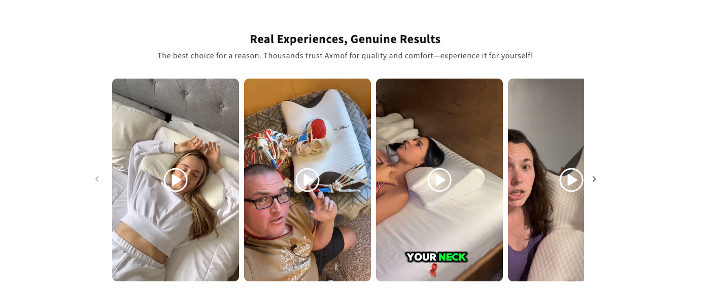

# Aom-public

## Axmof Omni Product Section Widget Content Block Configuration Reference

Public documentation for configuring Omni storefront content blocks.  
Use these JSON blocks in your Shopify theme or via the product metafield `psw` to compose rich sections like video testimonials, feature callouts, FAQs, and more.

---

## 🔰 Quick Start

Minimal working example combining a video carousel and a feature list:

```json
[
  {
    "id": "video-carousel",
    "type": "video-carousel",
    "title": "Real Experiences, Genuine Results",
    "subtitle": "Thousands trust Axmof for quality and comfort.",
    "backgroundColor": "#f0f8ff",
    "items": [
      {
        "thumbnail": "https://example.com/thumb1.webp",
        "url": "https://cdn.shopify.com/videos/vid1.mp4"
      }
    ]
  },
  {
    "id": "text-icon",
    "type": "text-icon",
    "width": "full",
    "backgroundColor": "#e8f5f9",
    "title": "Why Choose Axmof SweetNap Neck Pillow ?",
    "items": [
      {
        "title": "Perfectly supportive",
        "subtitle": "Engineered to deliver optimal support for your head, neck...",
        "svg": "<svg ...>...</svg>"
      }
    ]
  }
]
```

**How to use:** Paste into the designated theme/metafield slot `psw` that consumes block JSON. Your storefront renderer will interpret each block by its `type`.

---

## 📦 Block Reference

### 1. video-carousel

**Purpose:** Showcase user/testimonial videos in a horizontal carousel.



**Minimal Example:**

```json
{
  "id": "video-carousel",
  "type": "video-carousel",
  "title": "Real Experiences, Genuine Results",
  "subtitle": "Thousands trust Axmof for quality and comfort.",
  "backgroundColor": "#f0f8ff",
  "items": [
    {
      "thumbnail": "https://example.com/thumb1.webp",
      "url": "https://cdn.shopify.com/videos/vid1.mp4"
    }
  ]
}
```

**Fields:**

| Field             | Type   | Required | Description                             |
| ----------------- | ------ | -------- | --------------------------------------- |
| `id`              | string | ✓        | Unique identifier (internal reference). |
| `type`            | string | ✓        | Must be `"video-carousel"`.             |
| `title`           | string | ✗        | Heading above the carousel.             |
| `subtitle`        | string | ✗        | Subheading; HTML allowed.               |
| `backgroundColor` | string | ✗        | CSS color.                              |
| `items`           | array  | ✓        | List of video entries.                  |

**Item Fields:**

| Field       | Type         | Required | Description                               |
| ----------- | ------------ | -------- | ----------------------------------------- |
| `thumbnail` | string (URL) | ✓        | Preview image (prefer `.webp` optimized). |
| `url`       | string (URL) | ✓        | Video source (e.g., MP4).                 |

**Best Practices:**

- Host videos with appropriate CORS headers.
- Lazy-load offscreen videos for performance.
- Use optimized thumbnails.

---

### 2. text-icon

**Purpose:** Feature summary with icons, titles, and descriptions.


**Example:**

```json
{
  "id": "text-icon",
  "type": "text-icon",
  "width": "full",
  "backgroundColor": "#e8f5f9",
  "title": "Why Choose Axmof SweetNap Neck Pillow ?",
  "items": [
    {
      "title": "Perfectly supportive",
      "subtitle": "Engineered to deliver optimal support for your head, neck...",
      "svg": "<svg ...>...</svg>"
    },
    {
      "title": "Incredibly restful",
      "subtitle": "Ideal spinal alignment for deeper sleep.",
      "svg": "<svg ...>...</svg>"
    }
  ]
}
```

**Fields:**

| Field             | Type   | Required | Description                  |
| ----------------- | ------ | -------- | ---------------------------- |
| `title`           | string | ✗        | Section heading.             |
| `width`           | string | ✗        | Layout width (e.g., `full`). |
| `backgroundColor` | string | ✗        | Block background.            |
| `items`           | array  | ✓        | Features list.               |

**Item Fields:**

| Field      | Type   | Required | Description                     |
| ---------- | ------ | -------- | ------------------------------- |
| `title`    | string | ✓        | Feature name.                   |
| `subtitle` | string | ✓        | Description (HTML allowed).     |
| `svg`      | string | ✗        | Inline SVG markup for the icon. |

**Notes:**

- Sanitize SVG if user-supplied.
- Aim for uniform icon sizing (e.g., 40px viewport).

---

### 3. text-video

**Purpose:** Mixed content blocks combining text with embedded videos, often with layout variations.


**Example:**

```json
{
  "id": "text-video",
  "type": "text-video",
  "width": "full",
  "backgroundColor": "#f0f8ff",
  "items": [
    {
      "title": "Struggling with Poor Sleep and Body Aches?",
      "subtitle": "<strong>Tired of tossing and turning all night?</strong> ...",
      "thumbnail": "https://cdn.shopify.com/animated_pillow_video.webp",
      "url": "https://cdn.shopify.com/videos/...mp4"
    },
    {
      "title": "Feeling Overheated While You Sleep?",
      "subtitle": "Do you find yourself waking up drenched in sweat ...",
      "reverseLayout": "true",
      "alignContentCenter": "true",
      "thumbnail": "https://cdn.shopify.com/soft_plush_pillow_video.webp",
      "url": "https://cdn.shopify.com/videos/...mp4"
    }
  ]
}
```

**Common Fields in Item:**

- `title` (string)
- `subtitle` (string, HTML ok)
- `thumbnail` (string URL)
- `url` (string URL)
- `reverseLayout` (string `"true"` or boolean depending on consumer)
- `alignContentCenter` (string `"true"` or boolean)

---

### 4. feedback

**Purpose:** Highlight key statistics or customer satisfaction metrics.


**Example:**

```json
{
  "id": "feedback",
  "type": "feedback",
  "width": "full",
  "backgroundColor": "#f0f8ff",
  "title": "We reached out to our customers and discovered...",
  "subtitle": "Transform your sleep with the Axmof SweetNap Neck Pillow...",
  "thumbnail": "https://cdn.shopify.com/....webp",
  "items": [
    { "title": "94", "subtitle": "94% experience significant reduction..." },
    { "title": "92", "subtitle": "92% felt more Refreshed..." }
  ]
}
```

**Fields:**  
Title, subtitle, thumbnail (optional), and an array of score items with `title` and `subtitle`.

---

### 5. photo-carousel

**Purpose:** Display a gallery of photos (e.g., user-submitted or product-in-action).

**Example:**

```json
{
  "id": "photo-carousel",
  "type": "photo-carousel",
  "width": "full",
  "title": "Real People, Real Freshness",
  "subtitle": "...",
  "backgroundColor": "#f0f8ff",
  "items": [
    { "title": "axmof fruitpod in action", "thumbnail": "https://axmof.com/..." },
    ...
  ]
}
```

**Item Fields:**

- `title` (string)
- `thumbnail` (string URL)

---

### 6. faq

**Purpose:** Frequently asked questions in expandable format.


**Example Item:**

```json
{
  "title": "What makes Axmof SweetNap Neck Pillow any Better than my current pillow ?",
  "subtitle": "Axmof uses high density memory foam with an ergonomic design..."
}
```

**Container Fields:**  
`title`, `subtitle`, and `items` array of question-answer objects.

---

### 7. textImage (or text-image)

**Purpose:** Educational / persuasive content combining headings, rich HTML lists, and images.

**Example:**

```json
{
  "id": "text-image",
  "type": "textImage",
  "width": "full",
  "backgroundColor": "#f0f8ff",
  "items": [
    {
      "title": "How Fast Does Your Food Spoil?",
      "alignContentCenter": "true",
      "subtitle": "Once fruits and vegetables are cut, they begin losing freshness within hours: <ul>...</ul>",
      "thumbnail": "https://cdn.shopify.com/A1Lj1hVImEL.jpg"
    }
  ]
}
```

**Item Notes:**  
Supports `reverseLayout`, `alignContentCenter`, HTML in `subtitle`, and an image thumbnail.

---

### 8. product-compare

**Purpose:** Comparative feature list; useful for showing how Axmof stacks up.


**Example Skeleton:**

```json
{
  "title": "How we <em>compare</em>",
  "type": "product-compare",
  "company": "abc.dk",
  "items": [
    "Neck Support",
    "Pressure Relief",
    "Custom Fit",
    "Durability",
    "High-end Materials"
  ]
}
```

**Fields:**

- `title` (string)
- `type` (must be `product-compare`)
- `company` (string)
- `items` (array of strings)

---

## ⚠ Common Pitfalls

- Supplying malformed HTML in `subtitle` (sanitize or escape if needed).
- Missing required fields like `url` or `items` array.
- Using non-URL strings for thumbnails or video sources.
- Inconsistent boolean representation (`"true"` vs `true`): normalize per consumer expectations.

---

## 🎨 Styling & Theming

- `backgroundColor`: Accepts any valid CSS color (hex, rgb, etc.).
- `width`: Typically `full`; used for layout logic in the renderer.
- SVG icons: Keep viewBox consistent; recommend `40px` dimensions for uniformity.

---
